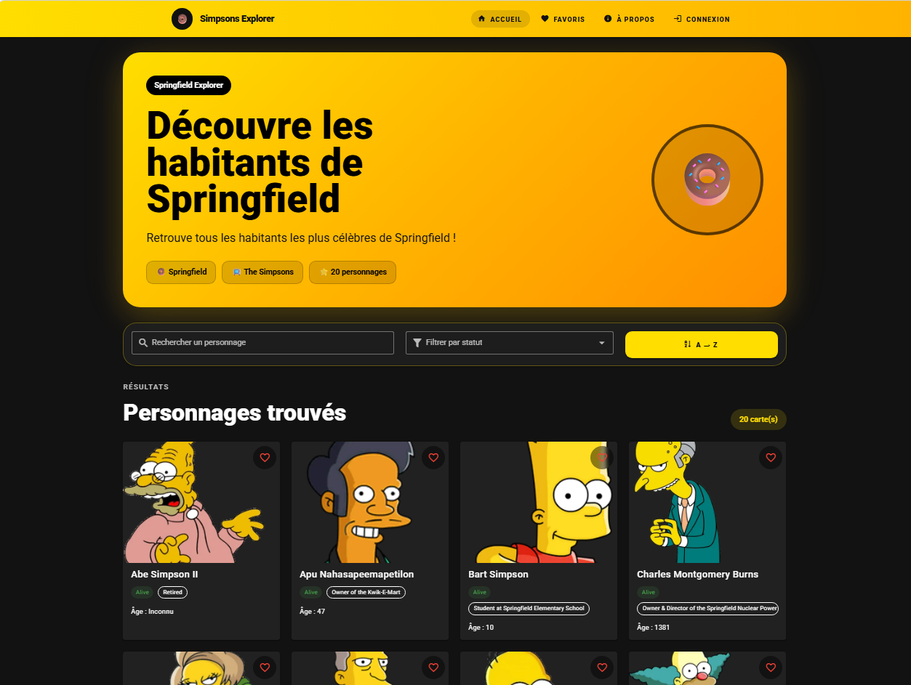
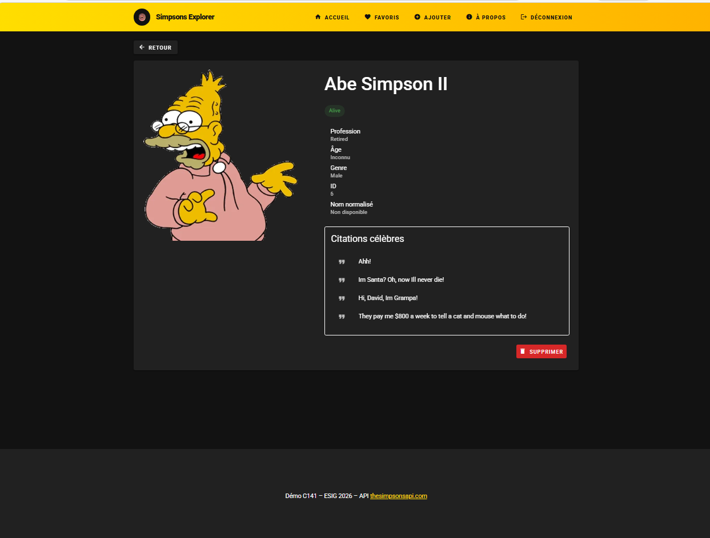
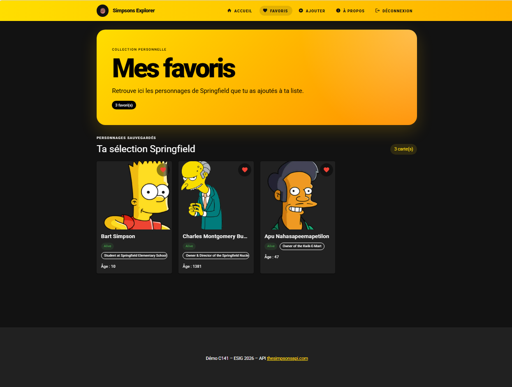
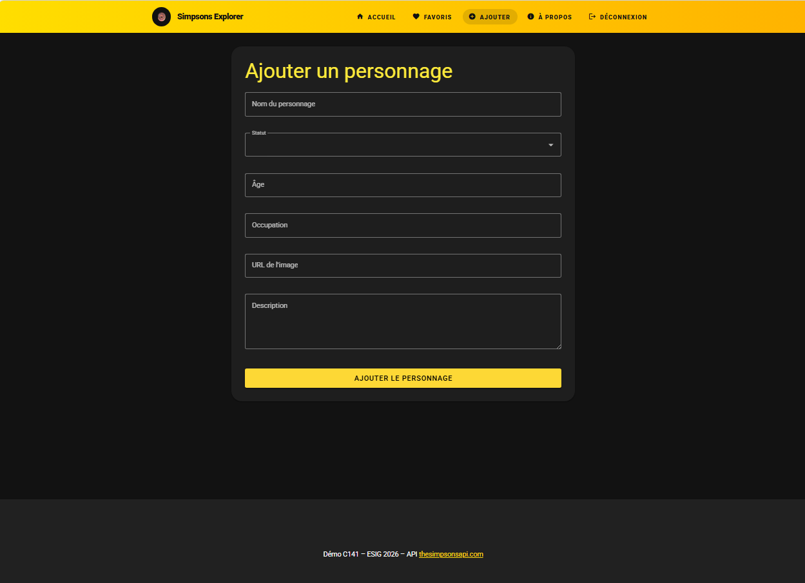
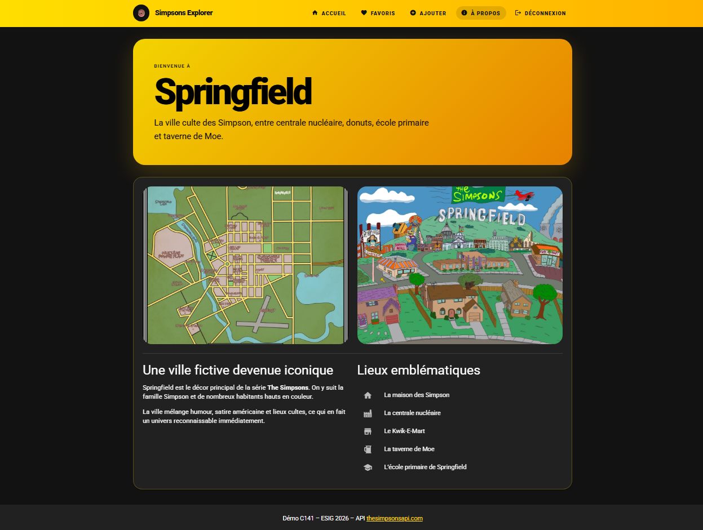
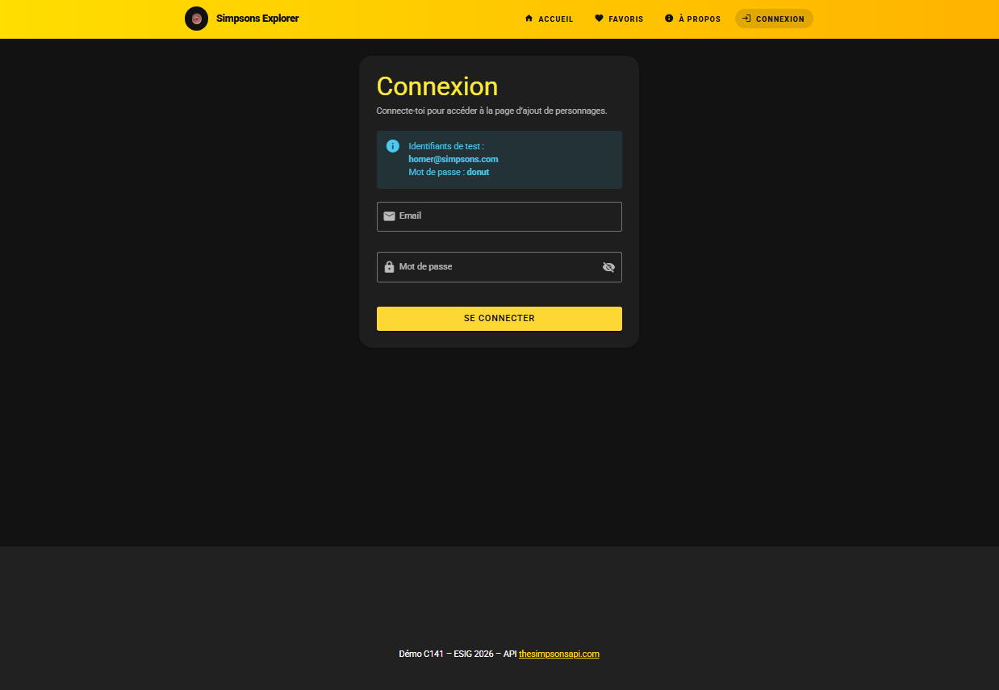

# Simpsons Explorer

Application Vue.js 3 permettant d’explorer les personnages emblématiques des Simpson.

## Démo en ligne

https://2026-141-simpsons.vercel.app

## Fonctionnalités

- Liste des personnages
- Recherche par nom
- Filtre par statut
- Tri alphabétique
- Page détail dynamique
- Ajout aux favoris
- Persistance des favoris avec localStorage
- Ajout de personnages personnalisés
- Suppression de personnages
- Authentification factice
- Protection de routes
- Design responsive mobile et desktop

## Technologies utilisées

- Vue.js 3
- Vuetify 3
- Pinia
- Axios
- Vue Router
- Vercel

## Installation

```bash
npm install
npm run dev
```

## Variables d’environnement

Créer un fichier `.env` :

```env
VITE_API_URL=https://thesimpsonsapi.com/api
```

## API utilisée

https://thesimpsonsapi.com/

Endpoint utilisé :

- `/characters`

## Structure du projet

```text
src/
├── components/
├── pages/
├── stores/
├── plugins/
├── router/
```

## Captures d’écran

### Accueil



### Détail personnage



### Favoris personnages



### Ajouter personnages



### À propos



### Connexion



## Authentification de démonstration

```text
Email : homer@simpsons.com
Mot de passe : donut
```

## Transparence IA

L’intelligence artificielle a été utilisée comme assistance pour :

- amélioration du design
- génération de composants Vue/Vuetify
- corrections de bugs
- optimisation du responsive design

Le projet a ensuite été compris, modifié et adapté manuellement.